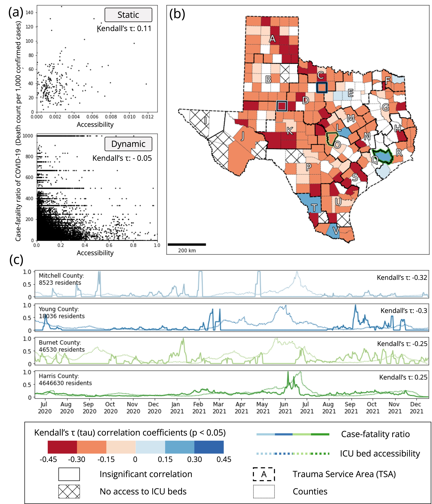

# Daily changes in spatial accessibility to intensive care unit (ICU) beds and their relationship with the case-fatality ratio of COVID-19 in the state of Texas

**Authors**: Jinwoo Park 1,2, Alexander Michels1,2, Fangzheng Lyu1,2, Su Yeon Han3, and Shaowen Wang1,2,*  
1 Department of Geography and Geographic Information Science, University of Illinois Urbana-Champaign  
2 CyberGIS Center for Advanced Digital and Spatial Studies, University of Illinois Urbana-Champaign  
3 Department of Geography and Environmental Studies, Texas State University, San Marcos, TX, USA  
\* Correspondence: Shaowen Wang, shaowen@illinois.edu  

Last Updated Date: Feb 10, 2023

Source: Park, J., Michels, A., Lyu, F., Han, S. & Wang, S. (2023). Daily changes in spatial accessibility to ICU beds and their relationship with the case-fatality ratio of COVID-19 in the state of Texas, USA. *Applied Geography*, 102929. https://doi.org/10.1016/j.apgeog.2023.102929

### Abstract:
During the COVID-19 pandemic, many patients could not receive timely healthcare services due to limited access to hospital infrastructure and human resources. Previous studies found that access to intensive care unit (ICU) beds saves lives, but they overlooked the temporal dynamics in the availability of healthcare resources and COVID-19 cases. To fill this gap, our study investigated daily changes in ICU bed accessibility with an enhanced two-step floating catchment area (E2SFCA) method. Along with the increased temporal granularity of measurements, we uncovered two phenomena: 1) aggravated spatial inequality of access during the pandemic and 2) the retrospective relationship between insufficient ICU bed accessibility and the high case-fatality ratio of COVID-19 in rural and suburban counties. Given our findings, we suggest that those locations should be supplemented with additional healthcare resources to save lives in future pandemic scenarios.
### Keywords:
Spatial accessibility, COVID-19, Healthcare resources, Case-fatality ratio 

### Featured Figures:

Figure. County-level correlation analysis (Kendall’s τ (tau)) between ICU bed accessibility and the case-fatality ratio of COVID-19: 
- (a) scatter plots of accessibility and the case-fatality ratio for both static and dynamic measurements
- (b) spatial distribution of Kendall’s τ calculated between ICU bed accessibility and the case-fatality ratio of COVID-19, 
- (c) temporal changes in accessibility and case-fatality ratio for counties that provided high negative correlation coefficients. 