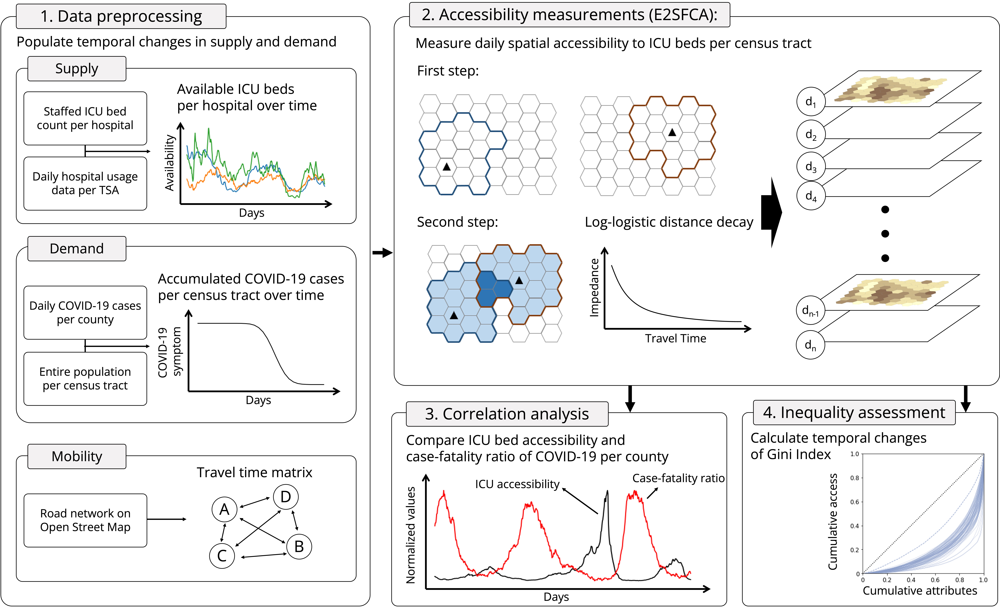

# Daily changes in spatial accessibility to intensive care unit (ICU) beds and their relationship with the case-fatality ratio of COVID-19 in the state of Texas

**Authors**: Jinwoo Park <sup>1,2</sup>, Alexander Michels<sup>1,2</sup>, Fangzheng Lyu<sup>1,2</sup>, Su Yeon Han<sup>1,2</sup>, and Shaowen Wang<sup>1,2,*</sup> <br>
<sup>1</sup> Department of Geography and Geographic Information Science, University of Illinois Urbana-Champaign <br>
<sup>2</sup> CyberGIS Center for Advanced Digital and Spatial Studies, University of Illinois Urbana-Champaign <br>
<sup>\*</sup> Correspondence: Shaowen Wang, shaowen@illinois.edu <br>

Last Updated Date: July 24, 2022

### Abstract:
During the COVID-19 pandemic, many patients could not receive timely healthcare services due to limited access to hospital infrastructure and human resources. Previous studies found that access to intensive care unit (ICU) beds saves lives, but they overlooked the temporal dynamics in the availability of healthcare resources and COVID-19 cases. To fill this gap, our study investigated daily changes in ICU bed accessibility with an enhanced two-step floating catchment area (E2SFCA) method. Along with the increased temporal granularity of measurements, we uncovered two phenomena: 1) aggravated spatial inequality of access during the pandemic and 2) the retrospective relationship between insufficient ICU bed accessibility and the high case-fatality ratio of COVID-19 in rural and suburban counties. Given our findings, we suggest that those locations should be supplemented with additional healthcare resources to save lives in future pandemic scenarios.
### Keywords:
Spatial accessibility, COVID-19, Healthcare resources, Temporal dynamics, ICU beds

## Repo structure
```bash
├── ST_Relationship_btw_ICU_Bed_Access_and_Mortality_of_COVID-19.ipynb (General procedure of study)
├── Data_Preprocessing.ipynb 
├── reference_data_creation.ipynb
├── data
│   ├── access
│   │   ├── ICU_access_measures (Result of accessibility measurements)
│   │   └── input_files (Input variables of accessibility measurements)
│   ├── original_data
│   │   ├── demand_related
│   │   ├── supply_related
│   │   └── tsa_county.json
│   └── reference_data
│       ├── covid_data
│       └── geographic_units
├── images
│   ├── accessibility_measures.jpg
│   ├── correlation_spacetime_re.jpg
│   ├── correlation_tau.jpg
│   ├── study_area_period.jpg
│   └── workflow.jpg
├── Accessibility_Measurements.py
├── Calculate_OD_Matrix.py
├── README.md
└── utils.py
```
## Research summary (Visit [Here](Daily changes in spatial accessibility to ICU beds during the COVID-19 pandemic.ipynb) for more information)
### Study area and period
Our study area is the state of Texas, which is the second-most populous state (29 million), and the study period is from July 1st, 2020, to December 31st, 2021 (18 months) to cover the starting point of the first major spread of COVID-19 in Texas (July 2020) to the present.


### Research workflow
Our study proceeds in four steps: 1) data preprocessing, 2) accessibility measurements, 3) correlation analysis, and 4) inequality assessment.
1. **The data processing step** aimed to populate temporal changes in supply (availability of ICU beds per hospital) and demand (confirmed COVID-19 cases per census tract). We also precomputed a travel time matrix between the hospitals (supply locations) and census tracts (demand locations) to facilitate further analysis. <br>
2. **Accessibility measurements step** utilized an E2SFCA method to assess spatial accessibility to healthcare resources during the COVID-19 pandemic under the interaction between the temporal changes of available ICU beds (supply) and the accumulated COVID-19 cases (demand). <br>
3. **Correlation analysis step** compared the daily accessibility and case-fatality ratio of COVID-19 per each county over time to uncover the retrospective linkage between increased death and insufficient access. <br>
4. **Inequality assessment step** calculated the daily changes in access inequality with the Gini index. <br>
**Note:** In the third and fourth steps, we also examined different results obtained from static (without temporal changes) and dynamic (with temporal changes) accessibility measurements and explored the benefits of incorporating temporal aspects into spatial accessibility assessments.


### Results
#### Daily measures of accessibility to ICU beds
During the study period, remarkable spatiotemporal changes in ICU bed accessibility were detected as the underlying variables (i.e., COVID-19 confirmed cases and the availability of ICU beds) dynamically fluctuated. Saturation in the maps indicates the level of accessibility of census tracts, and the boundaries of counties and TSA were provided to help the understanding of the locations.  


#### Correlation across time at county level
To investigate the spatiotemporal relationship between two variables, we increased the spatial or temporal granularity of correlation analysis as follows. First, we conducted a correlation analysis between ICU accessibility and mortality at the county level over the study period. This allowed us to explore which location provided a stronger negative correlation. Second, we analyzed the daily correlation between ICU bed accessibility and mortality for the entire study area to examine the temporal changes in correlation coefficients. We ran further correlation analyses for the period that provided a more substantial negative correlation. 
#### Correlation across time at county Level


#### Correlation across space at daily scale


