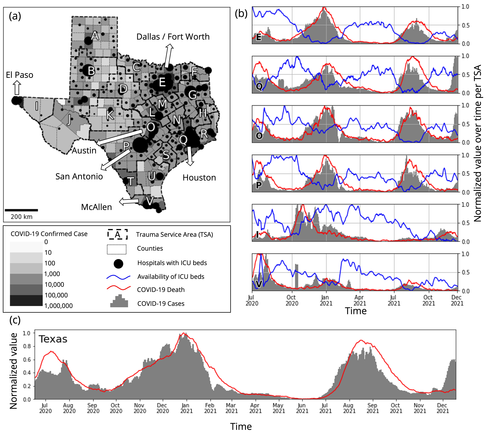
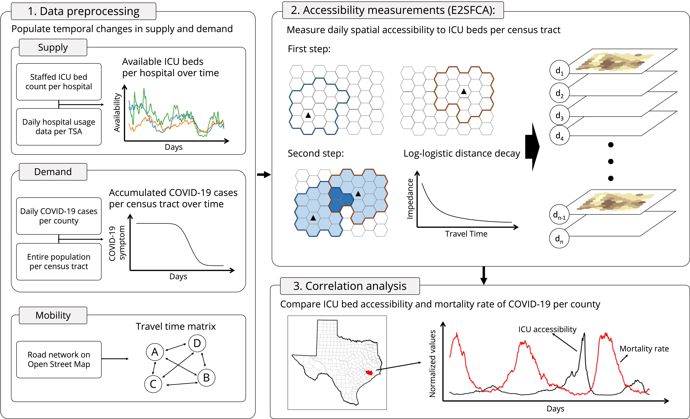
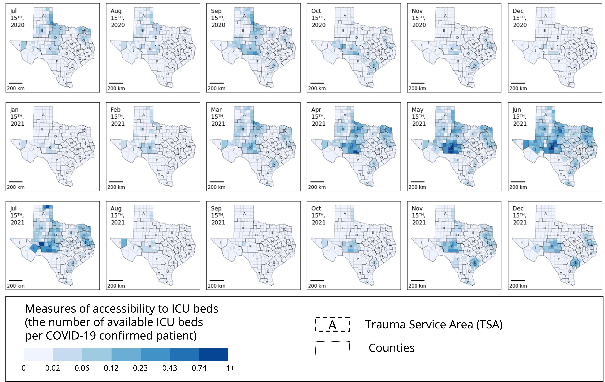
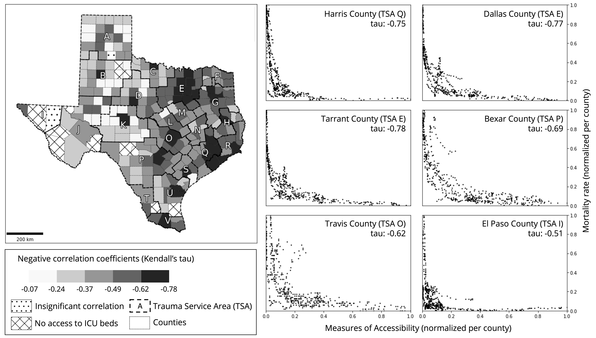
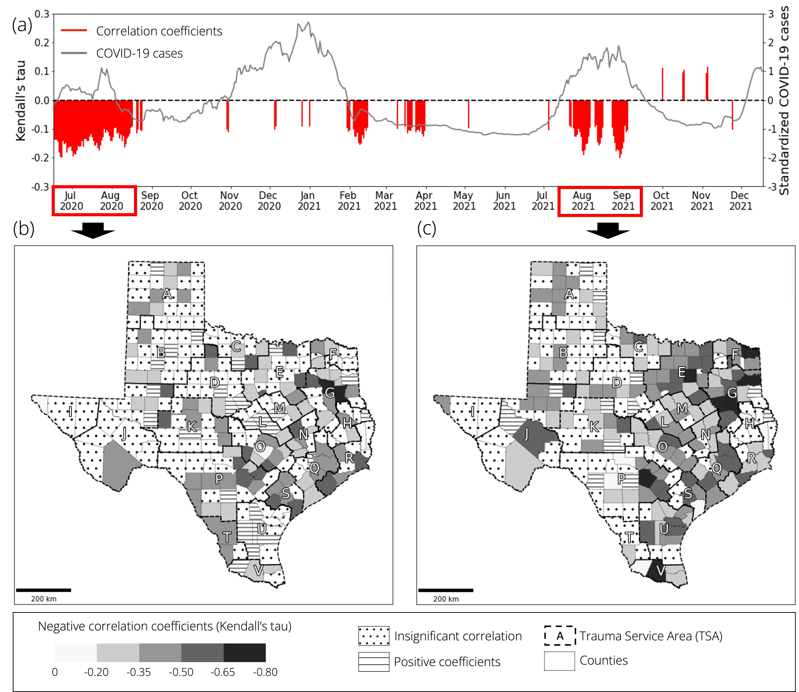

# Spatiotemporal relationships between spatial accessibility to intensive care unit beds and mortality of COVID-19 in the state of Texas

**Authors**: Jinwoo Park <sup>1,2</sup>, Alexander Michels<sup>1,2</sup>, Fangzheng Lyu<sup>1,2</sup>, Su Yeon Han<sup>1,2</sup>, and Shaowen Wang<sup>1,2,**</sup> <br>
<sup>1</sup> Department of Geography and Geographic Information Science, University of Illinois Urbana-Champaign <br>
<sup>2</sup> CyberGIS Center for Advanced Digital and Spatial Studies, University of Illinois Urbana-Champaign <br>
<sup> *</sup> Correspondence: Shaowen Wang, shaowen@illinois.edu <br>

Last Updated Date: May 26, 2022

### Abstract:
During the coronavirus disease 2019 (COVID-19) pandemic, many patients could not receive timely healthcare services due to limited access to hospital infrastructure and human resources. Previous research showed that sufficient access to healthcare resources, such as intensive care unit (ICU) beds and ventilators, is important to save lives. However, little attention has been paid to the underlying temporal dynamics of healthcare resource availability and COVID-19 cases. To fill this gap, our study aims to investigate the spatiotemporal relationships between spatial accessibility to ICU beds and the mortality of COVID-19, under the changes in ICU bed availability and COVID-19 confirmed cases. We first integrate the historical temporal changes of availability and confirmed cases to assess daily spatial accessibility to ICU beds with an enhanced two-step floating catchment area (E2SFCA) method. We then observe how insufficient accessibility to ICU beds and increased mortality are correlated with Kendall’s tau. As results, strong negative correlation coefficients were observed in the county-level analysis between sufficient accessibility to ICU beds and mortality of COVID-19. In addition, we found that populous counties in North, Southeast, and Central Texas showed a more substantial relationship than those in West Texas, which have sparse population density. Our study identified vulnerable areas where low spatial accessibility levels were highly related to deaths based on their retrospective relationship. We also suggested that extra resources might be necessary for big cities to adequately deal with the acute surge of patients, which could support policymakers in saving lives for future pandemic scenarios. 

### Keywords:
Spatial accessibility, COVID-19, Healthcare resources, Temporal dynamics, ICU beds

## Repo structure
```bash
├── ST_Relationship_btw_ICU_Bed_Access_and_Mortality_of_COVID-19.ipynb (General procedure of study)
├── Data_Preprocessing.ipynb 
├── reference_data_creation.ipynb
├── data
│   ├── access
│   │   ├── ICU_access_measures (Result of accessibility measurements)
│   │   └── input_files (Input variables of accessibility measurements)
│   ├── original_data
│   │   ├── demand_related
│   │   ├── supply_related
│   │   └── tsa_county.json
│   └── reference_data
│       ├── covid_data
│       └── geographic_units
├── images
│   ├── accessibility_measures.jpg
│   ├── correlation_spacetime_re.jpg
│   ├── correlation_tau.jpg
│   ├── study_area_period.jpg
│   └── workflow.jpg
├── Accessibility_Measurements.py
├── Calculate_OD_Matrix.py
├── README.md
└── utils.py
```
## Research summary (Visit [Here](archives/ST_Relationship_btw_ICU_Bed_Access_and_Mortality_of_COVID-19.ipynb) for more information)
### Study area and period
Our study area is the state of Texas, which is the second-most populous state (29 million), and the study period is from July 1st, 2020, to December 31st, 2021 (18 months) to cover the starting point of the first major spread of COVID-19 in Texas (July 2020) to the present.


### Research workflow
Our study proceeds in three steps: 1) data preprocessing, 2) accessibility measurements, and 3) correlation analysis. 
1. Data preprocessing step aimed to populate temporal changes in supply (availability of ICU beds per hospital) and demand (accumulated COVID-19 cases per census tract). We also precomputed a travel time matrix between the hospitals (supply) and census tracts (demand) to facilitate further analysis. <br>
2. Accessibility measurements step utilized an E2SFCA method to assess spatial accessibility to healthcare resources during the COVID-19 pandemic under the interaction between the temporal changes of available ICU beds (supply) and the accumulated COVID-19 cases (demand).
3. Correlation analysis compared the daily accessibility and mortality rate of each county over time to see if their temporal changes are correlated. In detail, we employed Kendall’s tau correlation coefficients because the distributions of those two variables are not linear. The method considers the variables based on their ranks but keeps their pairs. 



### Results
#### Daily measures of accessibility to ICU beds
During the study period, remarkable spatiotemporal changes in ICU bed accessibility were detected as the underlying variables (i.e., COVID-19 confirmed cases and the availability of ICU beds) dynamically fluctuated. Saturation in the maps indicates the level of accessibility of census tracts, and the boundaries of counties and TSA were provided to help the understanding of the locations.  


#### Correlation across time at county level
To investigate the spatiotemporal relationship between two variables, we increased the spatial or temporal granularity of correlation analysis as follows. First, we conducted a correlation analysis between ICU accessibility and mortality at the county level over the study period. This allowed us to explore which location provided a stronger negative correlation. Second, we analyzed the daily correlation between ICU bed accessibility and mortality for the entire study area to examine the temporal changes in correlation coefficients. We ran further correlation analyses for the period that provided a more substantial negative correlation. 
#### Correlation across time at county Level


#### Correlation across space at daily scale


